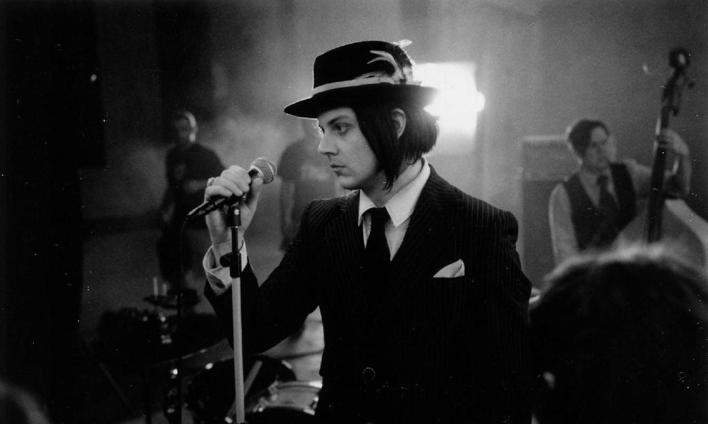

# Jack White

**John Anthony White** (уроджений Gillis; народився 9 липня 1975 року) - американський музикант, гітарист і вокаліст рок-дуету **The White Stripes**. Ключовий артист відродження гаражного року 2000-х років, він відомий своїми особливими музичними прийомами та ексцентричністю. Він виграв 12 _Grammy Awards_, серед інших нагород. _Rolling Stone_ включив його до списків найвидатніших гітаристів усіх часів у 2010 та 2023 роках. У 2012 році газета _New York Times_ назвала **White** «найкрутішою, найдивнішою та найкмітливішою рок-зіркою нашого часу».

source: _[Wikipedia](https://www.wikiwand.com/en/Jack_White)_

## Reviews of Albums
<a href="No_Name/README.md#no-name">NO NAME</a>

## Related links
<a href="../README.md">Return to Home</a>
