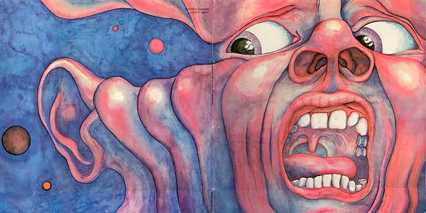
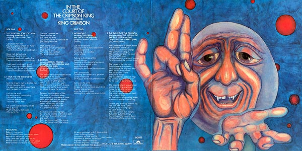

# In the Court of the Crimson King

## Wikipedia

**In the Court of the Crimson King** (subtitled An Observation by King Crimson) is the debut studio album by English progressive rock band King Crimson, released on 10 October 1969 by Island Records. The album is one of the earliest and most influential of the progressive rock genre, where the band combined the musical influences that rock music was founded upon with elements of jazz, classical, and symphonic music.

Considered by many critics to be one of the greatest progressive rock albums of all time, it reached number five on the UK Albums Chart and number 28 on the US Billboard 200, where it was certified Gold by the Recording Industry Association of America (RIAA).

source: ***[Wikipedia](https://www.wikiwand.com/en/In_the_Court_of_the_Crimson_King)***

## Rolling Stone
***JOHN MORTHLAND*** (Jun 17, 1997)

There are certain problems to be encountered by any band that is consciously avant-garde. In attempting to sound "farout" the musicians inevitably impose on themselves restrictions as real as if they were trying to stay in a Top-40 groove. There's usually a tendency to regard weirdness as an end in itself, and excesses often ruin good ideas. Happily, King Crimson avoids these obstacles most of the time. Their debut album drags in places, but for the most part they have managed to effectively convey their own vision of Desolation Row. And the more I listen, the more things fall into place and the better it gets.

The album begins by setting the scene with "21st Century Schizoid Man." The song is grinding and chaotic, and the transition into the melodic flute which opens "I Talk to the Wind" is abrupt and breathtaking. Each song on this album is a new movement of the same work, and King Crimson's favorite trick is to move suddenly and forcefully from thought to thought. "Epitaph" speaks for itself: "The wall on which the prophets wrote/Is cracking at the seams ... Confusion will be my epitaph."

"Moonchild" opens the second side, and this is the only weak song on the album. Most of its twelve minutes is taken up with short statements by one or several instruments. More judicious editing would have heightened their impact; as it is, you're likely to lose interest. But the band grabs you right back when it booms into the majestic, symphonic theme of "The Court of the Crimson King." This song is the album's grand climax; it summarizes everything that has gone before it: "The yellow jester does not play/But gently pulls the strings/And smiles as the puppets dance / In the court of the Crimson King."

This set was an ambitious project, to say the least. King Crimson will probably be condemned by some for pompousness, but that criticism isn't really valid. They have combined aspects of many musical forms to create a surreal work of force and originality.

Besides which they're good musicians. Guitarist Robert Fripp and Ian McDonald (reeds, woodwinds, vibes, keyboards, mellotron) both handle rock, jazz, or classical with equal ease. Bassist Greg Lakes and drummer Michael Giles can provide the beat, fill in the holes, or play free-form. While Dylan and Lennon are still safe, lyricist Peter Sinfield does show a gift (macabre as it may be) for free association imagery.

How effectively this music can be on stage is, admittedly, a big question. The answer is probably not too well. Still, King Crimson's first album is successful; hopefully, there is more to come.

source: ***[Rolling Stone](https://web.archive.org/web/20071022050233/http://www.rollingstone.com/artists/kingcrimson/albums/album/215038/review/6067524/in_the_court_of_the_crimson_king)***

## Pitchfork
***Ryan Reed*** (Nov 11, 2019)

> The perennially reissued, landmark debut from the prog rock giants doesn’t offer much memorable bonus material, but the album remains a towering pillar of musicianship, wonder, and menace. 

It’s all there in the Schizoid Man’s face. Barry Godber’s cover art—a man mid-scream, nostrils flared, gaze fixed on a horror we can’t see—teases a manic, transformative head trip. In the Court of the Crimson King marks a vast fault line in the geology of rock music, refining a nascent genre into a pinnacle of the progressive rock form. The Moody Blues’ symphonic grandeur, Brian Wilson’s expansive production, the psychedelic experiments of Pink Floyd and the Beatles—these are some of prog’s essential building blocks. But with their first record, King Crimson shaped those pieces into a monument, wielding a sorcery unduplicated in the five decades since.

The band summoned that collective force—a hybrid of menacing rock, classical sophistication, pastoral psychedelia, and free-jazz mania—quickly, almost instinctively, guided by what guitarist Robert Fripp has called “the presence of the Good Fairy.” The original Crimson lineup emerged from the ashes of short-lived psych-pop act Giles, Giles and Fripp in January 1969, with guitarist Fripp and drummer Michael Giles linking up with bassist-singer Greg Lake (future frontman of prog juggernaut Emerson, Lake & Palmer), keyboardist-woodwind player Ian McDonald, and lyricist Peter Sinfield. The quintet assembled in a cramped rehearsal space in London’s Hammersmith district, working on songs for three months before their proper live debut at the city’s Speakeasy club. By that summer, they’d even made a fan of Jimi Hendrix, who showed up for their gig at the Revolution Club and, as Fripp has frequently recalled, exclaimed, “This is the best group in the world!”

Within months, the band had developed into a formidable live act—even supporting the Rolling Stones at Hyde Park in July. But they were struggling in the studio, failing to make progress during two sessions with Moody Blues producer Tony Clarke. In a move equal parts brave and absurd (given Clarke’s high profile at the time), they decided to end that collaboration and helm their own material: They reconvened at London’s Wessex studio, armed with a handful of songs worthy of Hendrix’s standing ovation.

Like Godber’s cover image, much of their music was designed to provoke and scare. “It’s meant to be frightening,” an unidentified band member notes during the in-studio chatter of “Wind Session,” a newly mixed bonus track on Crimson King’s lavish 50th Anniversary reissue. In that previously issued leftover, the musicians workshop the discordant sci-fi woodwind noises that kick-start “21st Century Schizoid Man,” clustering exhalations into what sounds like TV static and future dial-up modems. After much gentlemanly discussion, they arrive at suitably “diabolical sounds.”

What follows “Schizoid Man”’s airy intro is even more jolting: seven minutes of nuclear proto-metal riffs, stuttering jazz-rock drum fills, wailing alto saxophone, and Lake’s distorted shriek—capped off with the paranoid prophecies of Sinfield, who used images of burning politicians and starving children to survey the destruction of the Vietnam War.

While King Crimson later evolved through a series of lineups under Fripp’s mysterious guidance, they achieved a rare level of creative intimacy on their debut. The four musicians composed “Schizoid Man” as a unit, practically breathing down each other’s necks in their rehearsal spot: They reacted to each other’s riffs and arrangements in real time, weaving old ideas (McDonald’s strutting sax section, lifted from a tune he wrote during his days in the Army jazz band, “Three Score and Four”) into new ones (Lake’s heavy main riff, countered by McDonald’s chromatic, ascending lick).

The final version of that song, which Kanye West famously sampled for his 2010 single “Power,” would be enough to cement King Crimson’s legend. And the 50th Anniversary edition offers a revelatory alternate version, building from a recently discovered backing track recorded in June 1969 during the aborted Clarke session at Morgan Studios. It’s a mutant of old and new, mingling 50-year-old parts (Giles’ violently demented kit-bashing, Lake’s finished vocal from the official LP) with a pair of modern-day overdubs (current members Mel Collins and Jakko Jakszyk doubling placeholder sax and guitar solos, respectively, with stereo-panned lines).

King Crimson have reissued In the Court of the Crimson King so many times, the album’s Discogs entry boasts more listings than a phone book. And considering most fans shelled out for the 40th Anniversary set one decade ago, this 3-CD/Blu-Ray is a tough sell for anyone who can’t name all of the band’s three present-day drummers. If blindfolded, most fans would have trouble distinguishing between Steven Wilson’s new stereo mix and the original they know by heart. And since the vaults have been mostly cleared over the years, the package’s real value boils down to a handful of unreleased gems. The centerpiece is a mostly a capella rendition of the morose ballad “Epitaph,” underscoring the wide dynamic range of Lake’s voice. Building from a fragile croon to a crackling, full-throated roar, it’s one of prog’s canonical performances.

Other bonus tracks are revealing but lack replay value—like the instrumental, bare-bones version of closing epic “The Court of the Crimson King.” (Listening to this track without the wordless vocal theme or the Grand Canyon-sized mellotron is physically painful, though intriguing as an in-progress footnote.) There’s also a faster alternate take of “Moonchild,” the album’s experimental descent into psychedelic texture and free improvisation—the sorta thing you’ll savor a couple times out of collector’s guilt but probably forget about within a week.

The original LP itself is enough, and always will be: Its fingerprint is so distinct that even imitators—including the entire prog-metal movement—can’t even accidentally sound like it. “You must have gathered it’s good,” the Who’s Pete Townshend wrote in a half-page advertisement promoting Crimson King. “But in some ways too good too soon if that’s possible.”

He was right in a practical sense: King Crimson’s jarring upward velocity could only carry them so far. The band crumbled after their first U.S. tour, leaving Fripp to rebuild as their de-facto maestro—restructuring the line-up again and again in search of “Good Fairy” dust. They found it, of course: Many of their subsequent records (the percussive pummel of 1973’s Larks’ Tongues in Aspic, the interlocking guitars and new wave sheen of 1981’s Discipline) glimpsed galaxies of new ideas as Fripp endlessly re-tooled his vision. But all roads branch out from the mighty Court.

source: ***[Pitchfork](https://pitchfork.com/reviews/albums/king-crimson-in-the-court-of-the-crimson-king-50th-anniversary)***

<a href="../README.md#king-crimson">Return to King Crimson</a>

