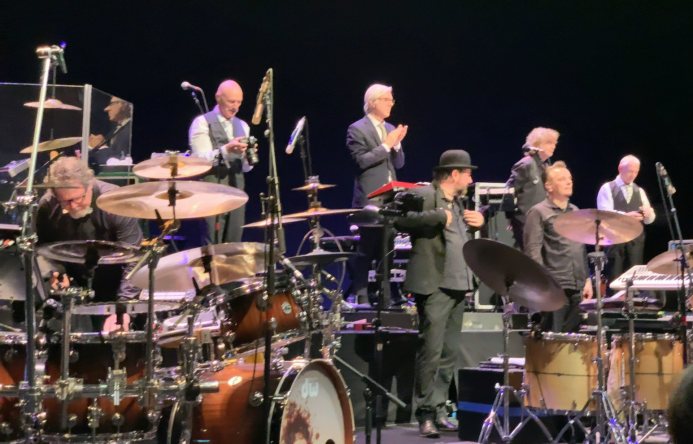

# King Crimson

**King Crimson** — британський гурт прогресивного року, заснований у січні 1969 року в Лондоні. Його засновником і єдиним постійним членом є _Роберт Фріпп_, віртуоз гітари і мелотрону.

Гурт знаходив натхнення в найрізноманітніших музичних напрямках, поєднуючи елементи _класики_, _джазу_, _фолку_, _хеві-металу_, _гамелану_, _блюзу_, _індастріалу_, _електроніки_, _експериментальної музики_ та _нью-вейву_. Через численні зміни складу гурт так і не сформував постійного звучання. Характерною рисою **King Crimson** є те, що гурт ніколи не відступав від авангардної концепції на користь полегшеного звучання. Гурт справив потужний вплив на прогресивний рок початку 1970-х років, зокрема на таких своїх сучасників, як **Yes** і **Genesis**, і продовжує надихати сучасні покоління музикантів різних жанрів. Гурт здобув велику кількість шанувальників.

Гурт заснували _Роберт Фріпп_, _Майкл Джайлз_, _Грег Лейк_, _Іен Макдональд_ та _Пітер Сінфілд_ і спочатку він зосередився на драматичному звучанні з активним використанням мелотрона, а також саксофона й флейти _Макдональда_ і потужного вокалу _Лейка_. Їхній дебютний альбом **In the Court of the Crimson King** (1969) — це неймовірна суміш джазу, класичної й експериментальної музики; він залишається найуспішнішим і найвпливовішим релізом. Після раптового одночасного виходу _Макдональда_ і _Джайлза_, а незабаром і _Лейка_, наступні два альбоми, **In the Wake of Poseidon** і **Lizard** (обидва 1970 року) були записані в умовах нестабільності в складі гурту. Уже в новому складі — _Роберт Фріпп_, _Пітер Сінфілд_, _Мел Коллінз_, _Боз Баррелл_ та _Іен Воллес_ — гурт записав альбом **Islands** у 1971 році. У середині 1972 року _Фріпп_, якого характеризує серйозне, майже місіонерське ставлення до своєї творчості, залишив цей склад і змінив інструментарій та підхід до написання музики, взявши за основу європейську вільну імпровізацію та розробляючи дедалі складніші композиції. У новому складі — _Білл Бруфорд_, _Джон Веттон_, _Девід Кросс_ і, ненадовго, _Джеймі М'юр_ — гурт, як вважають, досяг творчого піка на альбомах **Larks' Tongues in Aspic** (1973), **Starless and Bible Black** (1974) та **Red** (1974). Наприкінці 1974 року **King Crimson** у цьому складі розпався.

Після семи років бездіяльності **King Crimson** знову відродився у 1981 році, водночас змінивши музичний напрямок. До складу нового гурту увійшли _Фріпп_, _Бруфорд_ та нові учасники _Адріан Белью_ і _Тоні Левін_. Вони надихалися африканською музикою, гамеланом, постпанком та нью-йоркським мінімалізмом. У цьому складі гурт проіснував три роки; результатом його роботи стало три альбоми — **Discipline** (1981), **Beat** (1982) та **Three of a Perfect Pair** (1984).

Після 10-річної перерви гурт знову відродився у 1994 році. Цього разу до нього увійшли також _Пет Мастелотто_ і _Трей Ганн_. Так гурт перетворився на секстет; _Фріпп_ називав його _«подвійне тріо»_. Ця інкарнація гурту тривала ще три роки, протягом яких він випустив альбом **THRAK** (1995) та численні концертні записи. Між 1997 і 2000 роками знову була перерва.

Четверо учасників цього подвійного тріо возз'єдналися у 2000 році як новий **King Crimson**, цього разу вже як індустріально-орієнтований. Гурт у цьому складі називали _«подвійний дует»_. Він випустив альбоми **The ConstruKction of Light** (2000) і **The Power to Believe** (2003). Після п'ятирічної перерви гурт розширився (приєднався другий ударник _Гевін Гаррісон_) для туру 2008 року, присвяченого його 40-річчю.

Після чергової перерви (2009—2012) **King Crimson** знову зібрався разом у 2013 році, цього разу як септет, а пізніше октет, — з незвичним складом із трьох ударних установок і новим другим гітаристом і вокалістом _Якко Якшиком_. Ця інкарнація **King Crimson** гастролювала з 2014 по 2021 рік і випустила кілька концертних альбомів.

source: _[Wikipedia](https://www.wikiwand.com/en/King_Crimson)_

## Reviews of Albums
<a href="In_the_Court_of_the_Crimson_King/README.md#in-the-court-of-the-crimson-king">In the Court of the Crimson King</a>

## Related links

<a href="../README.md">Return to Home</a>