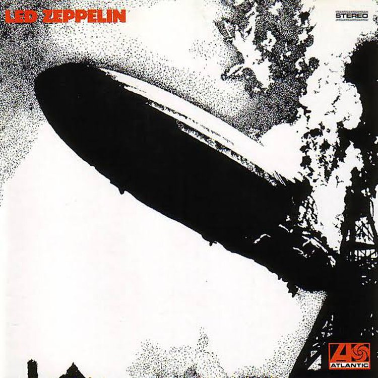

# Led Zeppelin
UK <a href="../README.md">EN</a>

## AllMusic
_Stephen Thomas Erlewine_

**Led Zeppelin** від самого початку мали повністю сформоване, самобутнє звучання, про що свідчить їхній однойменний дебютний альбом. Довівши важкий, спотворений електричний блюз **Jimi Hendrix**, **Jeff Beck** і **Cream** до крайнощів, **Zeppelin** створили величний, потужний бренд гітарного року, побудований на простих, запам'ятовуваних рифах і неповоротких ритмах. Але ключем до атаки гурту була витонченість: це був не просто натиск гітарного шуму, він був відтінений і текстурований, наповнений змінною динамікою і темпами. Як доводить **Led Zeppelin**, група була здатна на таку багатошарову музику з самого початку. Хоча протяжні психоделічні блюзи **Dazed and Confused**, **You Shook Me** та **I Can't Quit You Baby** часто привертають найбільшу увагу, решта альбому є кращим свідченням того, що станеться пізніше. **Babe I'm Gonna Leave You** переходить від фольклорних куплетів до потужних приспівів; **Good Times Bad Times** і **How Many More Times** мають грувові, блюзові переливи; **Your Time Is Gonna Come** - гімновий хард-рок; **Black Mountain Side** - чистий англійський фолк; і **Communication Breakdown** - шалений рокер з майже панківською атакою. Хоча альбом не такий різноманітний, як деякі з їхніх пізніших робіт, він, тим не менш, ознаменував собою значний поворотний момент в еволюції хард-року та хеві-металу.

source: <a href="https://www.allmusic.com/album/led-zeppelin-mw0000194593" target="_blank">_AllMusic_</a>

## Rolling Stone
_Greg Kot_ (August 20, 2001)

Поговоріть про те, щоб записати свій пунш на відео: На обкладинці **Led Zeppelin**, дебютного альбому британського квартету 1969 року, зображено дирижабль _Hindenburg_ у всій його фалічній красі, що охоплений полум'ям. Зображення досить добре інкапсулює музику всередині: секс, катастрофа і речі, що вибухають. З самого початку **Good Times Bad Times** відчувається чванливість: гітара **Jimmy Page** виривається з динаміків, повна погрози; малий барабан **John Bonham** розгойдується з силою ковадла; **Robert Plant** теревенить про небезпеки чоловічої статі. _Hard rock_ ніколи не буде колишнім. Можливо, існують кращі, більш вишукані альбоми **Zep**, ніж **Led Zeppelin**, також відомий як **Led Zeppelin I** - але жоден з них не звучить настільки ж приємно сиро і не є настільки ж вичерпним у визначенні намірів гурту. Хоча **Zep** відомі як родоначальники _heavy-metal_, вони також танцювали з _Chicago blues_, _British folk_ та _Eastern ragas_. Всі вони представлені на цьому дебютнику, спродюсованому **Page** і бездоганно спроектованому **Glyn Johns** під час тридцятигодинної сесії запису, яка застала гурт щойно після першого туру і сповненим амбіцій. Їхня самовпевненість стає настільки непристойною, що **Willie Dixon** ледве впізнав би свою **You Shook Me**, на якій **Page** і **Plant** схожі на вуличних котів, що забіякувато перегукуються між собою, підводячи класику блюзу до кричущого завершення.

Тріумф альбому полягає у володінні **Page** динамікою, від приливно-відливної послідовності дев'яти пісень до аранжувань, які драматизують широке розмаїття звукових барв. Делікатне акустичне перебирання пальцями гітариста під барабанний дріб на табла в **Black Mountain Side** поступається місцем _proto-punk_ **Communication Breakdown**, а непристойна **You Shook Me** тане у зловісному басовому інтро **John Paul Jones**, що анонсує **Dazed and Confused**. Витонченість буде відігравати набагато більшу роль у наступних роботах **Zeppelin**, а поки що місія полягала у створенні музики крайнощів, музики, яка б приваблювала хардкорних покупців альбомів, а не ринок _Top Forty_. Це ніколи не було більш правдивим, ніж на **Babe I'm Gonna Leave You**, похмурій народній пісні, доки не прорве греблю, **Bonham** не вирветься на волю і не з'являться обриси майбутніх речей - найвідоміша з них, пісенька під назвою **Stairway to Heaven** - промайне.

source: <a href="https://www.rollingstone.com/music/music-album-reviews/led-zeppelin-252726/" target="_blank">_Rolling Stone_</a>

## Track listing

1. "Good Times Bad Times" - 2:47 _(John Bonham, John Paul Jones, Jimmy Page)_
2. "Babe I'm Gonna Leave You" - 6:41 _(Anne Bredon, Jimmy Page, Robert Plant)_
3. "You Shook Me" - 6:30 _(Willie Dixon, J.B. Lenoir)_
4. "Dazed and Confused" - 6:27 _(Jimmy Page)_
5. "Your Time Is Gonna Come" - 4:34 _(John Paul Jones, Jimmy Page)_
6. "Black Mountain Side" - 2:13 _(Jimmy Page)_
7. "Communication Breakdown" - 2:30 _(John Bonham, John Paul Jones, Jimmy Page)_
8. "I Can't Quit You Baby" - 4:43 _(Willie Dixon)_
9. "How Many More Times" - 8:28 _(John Bonham, John Paul Jones, Jimmy Page)_

## Related links
<a href="../../README.md">Return to Led Zeppelin</a>