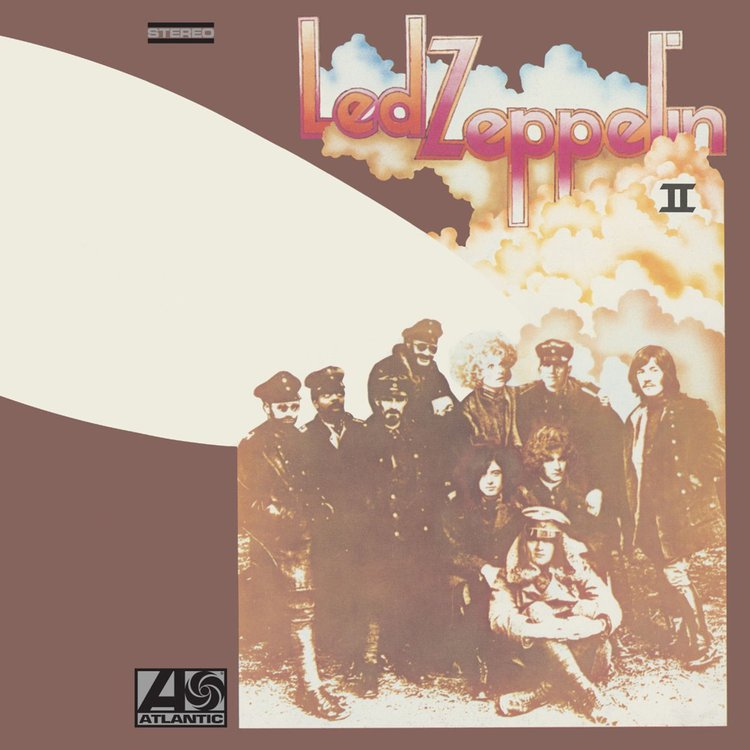

# Led Zeppelin II
EN <a href="UK/README.md">UK</a>

## AllMusic
_Stephen Thomas Erlewine_

Recorded quickly during **Led Zeppelin**'s first American tours, **Led Zeppelin II** provided the blueprint for all the _heavy metal_ bands that followed it. Since the group could only enter the studio for brief amounts of time, most of the songs that compose II are reworked _blues_ and _rock & roll_ standards that the band was performing on-stage at the time. Not only did the short amount of time result in a lack of original material, it made the sound more direct. **Jimmy Page** still provided layers of guitar overdubs, but the overall sound of the album is heavy and hard, brutal and direct. **Whole Lotta Love**, **The Lemon Song**, and **Bring It on Home** are all based on classic _blues_ songs -- only, the riffs are simpler and louder and each song has an extended section for instrumental solos. Of the remaining six songs, two sport light acoustic touches (**Thank You**, **Ramble On**), but the other four are straight-ahead _heavy rock_ that follows the formula of the revamped blues songs. While **Led Zeppelin II** doesn't have the eclecticism of the group's debut, it's arguably more influential. After all, nearly every one of the hundreds of **Zeppelin** imitators used this record, with its lack of dynamics and its pummeling riffs, as a blueprint.

source: <a href="https://www.allmusic.com/album/led-zeppelin-ii-mw0000190649" target="_blank">_AllMusic_</a>

## Track listing

1. "Whole Lotta Love" - 5:35 _(John Bonham, Willie Dixon, John Paul Jones, Jimmy Page, Robert Plant)_
2. "What Is and What Should Never Be" - 4:45 _(Jimmy Page, Robert Plant)_
3. "The Lemon Song" - 6:19 _(John Bonham, Chester Burnett, John Paul Jones, Jimmy Page, Robert Plant)_
4. "Thank You" - 4:49 _(Jimmy Page, Robert Plant)_
5. "Heartbreaker" - 4:14 _(John Bonham, John Paul Jones, Jimmy Page, Robert Plant)_
6. "Living Loving Maid (She's Just a Woman)" - 2:39 _(Jimmy Page, Robert Plant)_
7. "Ramble On" - 4:23 _(Jimmy Page, Robert Plant)_
8. "Moby Dick" - 4:20 _(John Bonham, John Paul Jones, Jimmy Page)_
9. "Bring It On Home" - 4:19 _(Jimmy Page, Robert Plant, John Paul Jones, John Bonham, Willie Dixon)_

## Related links
<a href="../README.md">Return to Led Zeppelin</a>