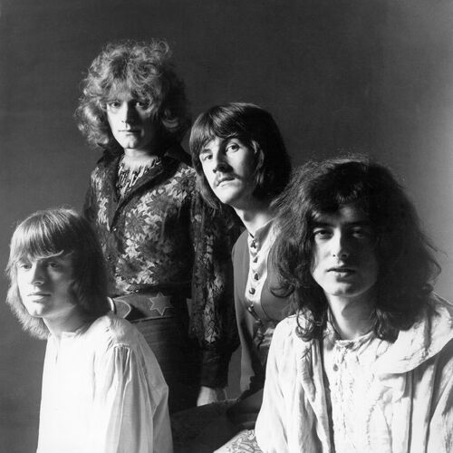

# Led Zeppelin

**Led Zeppelin** — британський рок-гурт, що вважається одним із засновників хард-року та геві-металу.

Попри своє фактичне розформування 40 років тому внаслідок смерті барабанщика **Джона Бонема** у 1980 році, Led **Zeppelin** досі високо шанується за музичні досягнення, нестандартність, комерційний успіх і широкий вплив. Гурт продав понад 300 мільйонів альбомів у світі, включно із 112 мільйонами в США. Усі їхні студійні роботи, що не були компіляціями, потрапили в Top 10 часопису _Billboard_ (США). **Led Zeppelin** є першими у списку 100 найвизначніших хард-рокових виконавців від _VH1_. Журнал _Rolling Stone_ визначає **Led Zeppelin** як «найважчий гурт усіх часів» і «найвизначніший гурт 70-х». 1995 року **Led Zeppelin** уведені до Зали слави рок-н-ролу, 2005-го отримали _Grammy_ за значний внесок у розвиток музики, а в травні 2006-го — _Polar Music Prize_ (музичний аналог Нобелівської премії).

source: _[Wikipedia](https://omni.wikiwand.com/uk/articles/Led_Zeppelin)_

## Reviews of Albums
<a href="Led_Zeppelin/README.md#led-zeppelin">Led Zeppelin</a>

<a href="Led_Zeppelin_II/README.md#led-zeppelin-ii">Led Zeppelin II</a>

## Related links
<a href="../README.md">Return to Home</a>
