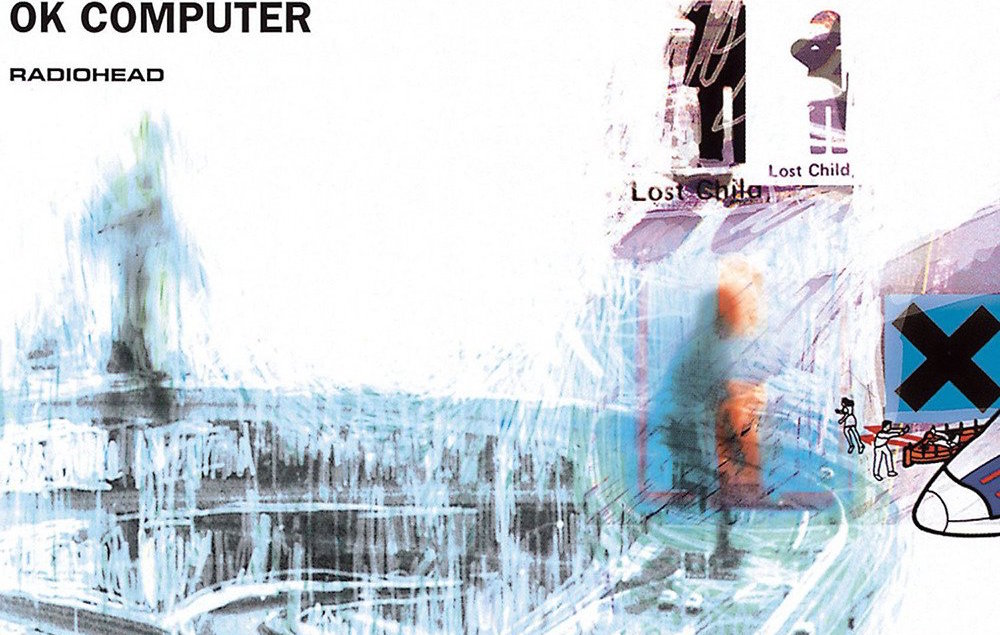

# Ok Computer
EN <a href="UK/README.md">UK</a>

## Wikipedia

**OK Computer** is the third studio album by the English rock band **Radiohead**, released on 21 May 1997. With their producer, _Nigel Godrich_, **Radiohead** recorded most of **OK Computer** in their rehearsal space in Oxfordshire and the historic mansion of St Catherine's Court in Bath in 1996 and early 1997. They distanced themselves from the guitar-centred, lyrically introspective style of their previous album, **The Bends**. **OK Computer**'s abstract lyrics, densely layered sound and eclectic influences laid the groundwork for **Radiohead**'s later, more experimental work.

The album's lyrics depict a dystopian, futuristic world fraught with rampant consumerism, capitalism, social and modern alienation, emotional isolation and political malaise, with overall themes like transport, technology, insanity, death, modern British life, globalisation and anti-capitalism; in this capacity, **OK Computer** is said to have prescient insight into the mood of 21st-century life. The band used unconventional production techniques, including natural reverberation, and no audio separation. Strings were recorded at Abbey Road Studios in London. Most of the album was recorded live.

Despite lowered sales estimates by EMI, who deemed the record uncommercial and difficult to market, **OK Computer** reached number one on the UK Albums Chart and debuted at number 21 on the Billboard 200, **Radiohead**'s highest album entry on the US charts at the time, and was soon certified five times platinum in the UK and double platinum in the US. _"Paranoid Android"_, _"Karma Police"_, _"Lucky"_ and _"No Surprises"_ were released as singles. The album expanded **Radiohead**'s international popularity and has sold at least 7.8 million units worldwide.

**OK Computer** received acclaim and has been cited as one of the greatest albums of all time. It was nominated for Album of the Year and won Best Alternative Music Album at the 1998 Grammy Awards. It was also nominated for Best British Album at the 1998 Brit Awards. The album initiated a stylistic shift in British rock away from Britpop toward melancholic, atmospheric alternative rock that became more prevalent in the next decade. In 2014, it was included by the United States Library of Congress in the National Recording Registry as "culturally, historically, or aesthetically significant". A remastered version with additional tracks, OKNOTOK 1997 2017, was released in 2017, marking the album's twentieth anniversary. In 2019, in response to an internet leak, **Radiohead** released MiniDiscs [Hacked], comprising hours of additional material.

source: _[Wikipedia](https://www.wikiwand.com/en/OK_Computer)_

## Rolling Stone
_MARK KEMP_ (July 10, 1997)

THE DAYS OF whine and poses may be over, but don’t tell that to **Radiohead** singer **Thom Yorke**. He has survived the demise of grunge with all of his anxiety and disillusionment intact. Which hardly means that his group’s music hasn’t matured. On the contrary, **Radiohead** are one of the few guitar-based bands of the mid-’90s that has grown by leaps and bounds. When their first single, **Creep**, leapt out of _MTV’s Buzz Bin_, in 1993, it came off like a **Nirvana** wanna-be from hell; the song’s obligatory loud/soft dynamics and Yorke’s self-deprecating lyrics rang empty. But one listen to Radiohead’s third album, **OK Computer** — a stunning art-rock tour de force — will have you reeling back to their debut, **Pablo Honey**, for insight into the group’s dramatic evolution.

In retrospect, the seeds of a powerful band were there from the beginning. **Pablo Honey** was a spotty affair, but **Yorke**’s soaring, **Bono**-esque voice and the instrumental prowess of the band pointed to **Radiohead**’s more ambitious second outing, **The Bends**. On that record, the music not only complemented **Yorke**’s pretty voice and pensive lyrics but it built on them, sculpting his expressions of inner conflict (“_I need to wash myself again to hide all the dirt and pain._”) into universal meditations on the kind of primal anguish that we all experience from time to time. The songs were stronger — owing more to the **Beatles** this time than to **U2** — and **Radiohead** had expanded their palette to include heavy doses of psychedelic guitar, electronics and hints of glam rock.

On **OK Computer**, **Radiohead** take the ideas they had begun toying with on **The Bends** into the stratosphere. At a time when they could have played it safe, selling their psychedelic souls for more radio-friendly rock & roll, **Radio-head** have released a concept album whose theme — based on rock’s age-old fear of the imminence of a world run by computers — unfolds gradually during the course of the album’s 12 songs.

**OK Computer** is not an easy listen. From guitarist **Jonny Greenwood**’s menacing riff that introduces the opener, **Airbag**, to **Yorke**’s fragile pleas to “slow down” on the final track, **The Tourist**, each song takes time to reveal itself as a narrative link to the album’s ultimately spiritual message. In the suite **Paranoid Android**, acoustic and electric instruments float understatedly through the mix as **Yorke** sings, through clenched teeth, lines like “_Ambition makes you look very ugly._” Complex tempo changes, touches of dissonance, ancient choral music and a **King Crimson**-like melodic structure propel the song to its conclusion, where **Yorke** sings in a pleading voice, “_God loves his children._”

There are moments on **Paranoid Android** when **Yorke** sounds as though he’s conjuring the spirit of **Queen**’s **Freddie Mercury**. On several other tracks, **Radiohead** also draw from the past for inspiration. **Yorke**’s throwaway words to **Karma Police** (“_This is what you get when you mess with us_”) are rescued by the layered, **Strawberry Fields Forever** vibe of the music. **Let Down** is driven by **Byrds**-like chiming guitars. And the **Eno**-esque ambience of **Fitter Happier** — based around a computerized voice intoning platitudes like “_Comfortable/Not drinking too much/Regular exercise at the gym … /Calm, fitter, healthier and more productive_” — gives the song a claustrophobic, Doll’s House feel.

Like **R.E.M.**’s recent **New Adventures in Hi-fi**, the music on **OK Computer** has a surreal, cinematic quality. Also like the **R.E.M.** record, this album hints at some kind of dark spiritual crossroad. In the delicate **No Surprises**,” _Yorke_ announces, “_This is my final fit, my final bellyache._” Where **Radiohead** might go from here is anyone’s guess, but **OK Computer** is evidence that they are one rock band still willing to look the devil square in the eyes.

source: _[Rolling Stone](https://www.rollingstone.com/music/music-album-reviews/ok-computer-189802/)_

## Q Magazine
_David Cavanagh_ (July 1997)

> Radiohead: theirs is a queer old landscape

With their 1.5 million-selling 1995 album **The Bends**, **Radiohead** executed something of a perfect Yin Yang: a great white hope and a big black cloud. Thematically, a cold look at a worn-down, scrofulous interior - **Thom Yorke**'s lyric sheet did not so much scan as a fester - it was one of the great "tension" records of recent years. It was streets ahead of the fundamental volleys of angst to be found elsewhere in guitar rock that year and, indeed, on **Radiohead**'s own perfunctory 1993 debut album, **Pablo Honey**.

A new song, a gripping plea for rescue entitled **Lucky** - released in September, 1995 on the War Child compilation album Help - gave a tantalising indication of what their third album might contain. But now it transpires that Radiohead are even better than anybody imagined. The Bends was merely stage two in a long process of preparation for the overwhelming music of OK Computer.

**Radiohead** are known as a dynamic and neurotic three-guitar band, but the majority of **OK Computer**'s 12 songs (one of which is **Lucky**) takes place in a queer old landscape: unfamiliar and ominous, but also beautiful and unspoiled. They produced this album themselves (in their _Oxfordshire_ studio), constructing an eerie sound-world that is both purpose-built - a five-piece rock band has rarely been better recorded - and oddly evocative of a 1984 lyric by the American group **Let's Active** that talked of "_moonstruck eyes and grey scales_". It's not always easy to determine which instrument makes which noise. The melodies are unorthodox and tangential: there are no **Justs**, **Creeps** or **Nice Dreams**. It's a huge, mysterious album for the head and soul.

To hear one of these songs alone is to catch one's breath: it's an unknown **Radiohead**. To hear the whole album is to have one's milieu well and truly up-ended and one's imagination repeatedly caught off guard by **Radiohead**'s expanded ammo-haul of treated guitars, Mellotrons (played by the increasingly dazzling _Jonny Greenwood_), electric pianos (ditto) and unforseen space effects. A lot of prog rock fans will get off on the album's more planetarium-compatible noises (to say nothing of _Greenwood_'s **King Crimson**-style guitar chords on the opening track, **Airbag**). That said, **OK Computer** is not a goblin zone. In his often extraordinary lyrics, **Yorke** glares as cynically and as disgustedly at life as he did on **The Bends**. But look at how he's writing now: "_Regular exercise at the gym three days a week...Getting on better with your associate employee contemporaries...Fitter, healthier and more productive/A pig in a cage on antibiotics_" (**Fitter, Happier**). **Yorke** is on top form.

"_Hanging on in quiet desperation is the English way,_ " **Pink Floyd** told us in 1973. Twenty-four years later, **Yorke** out-writes **Roger Waters** with heavy sarcasm (and to a better tune, incidentally): "_I'll take a quite life, a handshake of carbon monoxide and no alarms and no surprises, please_" (**No Surprises**). Whereas **Dark Side Of The Moon** was about madness, meadows and muddling along, **OK Computer** - along with **The Smashing Pumpkins**' **Mellon Collie And The Infinite Sadness** the present-day rock-fans closest equivalent to a '70s behemoth LP - evokes the sensation of the frequent flyer who has suddenly noticed he's travelling faster than his aircraft. "_Sometimes I get overcharged_", reflects **OK Computer**'s **The Tourist**. "_that's when you see sparks/Theu ask me where I'm going at a thousand feet per second/Hey man, slow down, slow down..._".

As for the actual Earth, lyric after anguished lyric declares it an unfit place to live on, and condemns **Yorke** himself as not fit to walk it - so where does that leave him? The answer ultimately arrives on **Subterranean Homesick Alien**. **Yorke**, driving along a country lane at night, longs to be carried off by a spaceship. Nice planet. You can have it. Small wonder much of **OK Computer** sounds not-quite-of-this-world.

Indeed, the first three tracks (of a five-song, continuous, 25-minute suite that's as brilliant as any music of the last decade) all mention aliens or interstellar activity in some capacity. "_I'm back to save the universe_", **Yorke** sings on **Airbag**, over a deeply sinister soundtrack of Mellotron, cross-purpose guitars (_J.Greenwood_, _Yorke_ and _Ed O'Brien_), reggae-style bass (_Colin Greenwood_) and hissing, spitting drums (_Phil Selway_).

If **Airbag** is merely fascinating, **Paranoid Android** is simply the song of the year. The first single, it's six-and-a-half minutes long and it comes in three sections. One of these even has it's own sub-section. There's terrific, jazzy 7/8 part with electric piano and deep-grooving bass; there's a hefty dose of blistering rock (with two guitar solos); and there's a truly awesome vocal harmony sequence reminiscent of a load of monks chanting a particularly intense extract from **David Bowie**'s **The Man Who Sold The World**.

Although only one song on **OK Computer** is what you'll call fast - **Electroneering**, coincidentally the worst track - it's got to be said that **Subterranean Homesick Alien**, **Exit Music (For A Film)** and **Let Down** are unusually slow and thoughtful. **Subterranean Homesick Alien** has wonderful, tingling, golden guitars and **Riders On The Storm**-style electric piano. **Let Down** begins like a delicately chiming appendix to **The Joshua Tree**, but the crazy synthesizers start to fly in from all directions, like a laser show. And as **Let Down**'s guitar arpeggios drip-drip-drip into the brain, **Yorke** - one of the very few singers whose voice can appear to convey genuine grief (as opposed to pain) and despair (as opposed to frustration) - delivers a remarkable vocal: falsetto, glorious harmonies, total and utter harmonies. His voice has the terrible shiver of a toddler who can't for the life of him stop crying.

Just before **Let Down** comes a gem of a song called **Exit Music (For A Film)**. It concerns two young lovers leaving home and going on the run. Being a **Yorke** composition, it's not exactly **Moonlighting** by **Leo Sayer**. **Jonny Greenwood**'s Mellotron produces an unearthly choir of basses and sopranos as one of the runaways implores the other, "_Breathe, keep breathing, I can't do this alone_". Then, during a murderous surge of drums and fuzz bass, the picture goes fuzzy. The fog clears just in time to hear **Yorke** moan the last, startling line: "_We hope that you choke_".

The superb **Karma Police**, written about a party full of scary people, is what might resulted musically had **The Bogus Man**-period **Roxy Music** ever tried to play **Sexy Sadie** by **The Beatles**. Even weirder is **Fitter, Happier**. An aural nightmare with no precedent in **Radiohead**'s work, it's a poem of doom, centered in the workplace recited by a pre-programmed _Apple Mac_ that sounds like _Stephen Hawking_'s electronic voice. The breakneck (and somehow unsatisfying) **Electroneering** kicks up a royal fuss, before collapsing into the uneasy trip-hop of **Climbing Up The Walls**. It now seems as though **OK Computer**'s second half will comprise nothing but menace and cacophony.

Suddenly, however, there's a respite from this two-song burst of chaos. In fact, the final three-song sequence has more control, more room to breathe (and arguably more beauty) than any other part of the record. Each of these three songs is the match of **Street Spirit (Fade Out)** on **The Bends**. **No Surprise** is **Radiohead**'s prettiest moment to date, using dulcimer and Christmassy synth textures to decorate **Ed O'Brien**'s exquisite guitar refrain. A lesser band would have grafted **Yorke**'s withering lyric onto a ready-made anthem of barely adequate string-bending pique.

**The Tourist**, which follows the still-spooky-and-marvellous **Lucky** to conclude the album, is an unexpectedly bluesy waltz. It's not easy to play a waltz with anxiety, let alone the panic felt by **Yorke**'s hyperventilating traveller, but they do. As it reaches its final bars, the three guitars fall out, leaving just **Phil Selway**'s brushed cymbals, a couple of plucks of **Colin Greenwood**'s bass and - finally - the "ding" of a tiny bell.

And that is that. A landmark on every latitude. Not the least achievement of **OK Computer** is that a major weirdo-psychological English guitar band can induce gasps of admiration, stunned silence and more than a few lumps in the throat. It's and emotionally draining, epic experience. Now **Radiohead** can definitely be ranked high among the world's greatest bands.

source: _[Q Magazine](http://www.qonline.co.uk/reviews/server.asp?id=18513&ss=radiohead&cs=artist&st=cn&stars=NaN&cp=1)_

## Pitchfork
_Ryan Schreiber_ (1999)

Thru space at 1.2 light years per hour, **Radiohead**'s third piece of incredible work, **OK Computer**, is not only their best yet, but one the year's greatest releases.

The record is brimming with genuine emotion, beautiful and complex imagery and music, and lyrics that are at once passive and fire-breathing. **OK Computer** is like tossing **David Bowie**, old **U2**, **Spacehog** and lots of **Pink Floyd** into a blender and pushing the 'kill' button.

**Thom Yorke**'s fragile vocals backed by the intricate guitar duels of **Jonny Greenwood** and **Ed O'Brien**, **Phil Selway**'s intense, rhythmic pounding and the subtle but effective bass guitar of **Colin Greenwood** sends an energetic flare clean through your speakers, hurtling into the room around you and charging the air with static electricity. When **Yorke** sings, "_In an interstellar burst / I am back to save the universe_", you believe him.

**OK Computer** is the first album to intellegently express vehement hatred toward the corporate world's replacement of human emotion and personality with robotic behavior in their attempt to be "more professional." **Yorke**'s disgust with self- help programs and "successful" businessmen is the focus, and if you're a person with any integrity whatsoever that's set foot in a Class A office building, you can probably relate.

**Radiohead** only seem to get better as time progresses, but **Thom Yorke**'s expressed some doubt as to whether or not they can ever top this record. If they can, they'll have established themselves as one of the most outstanding rock bands the '90s had to offer. If not, they still came out of the deal with one album of unadulterated genius. Time will tell.

source: _[Pitchfork](http://www.pitchforkmedia.com/record-reviews/r/radiohead/ok-computer.shtml)_

## NME
_James Oldham_ (1999)

LOOK OUTSIDE and you'll see it. A typical view: cars in the street, wires overhead and, somewhere above, the distant trails of an already departed plane. Step away from the window and there's more of the same: a video recording, a TV screen full of flickering images and a newspaper plastered with remote news. You sip a glass of water, but even that tastes of chalk and chlorine. There's no way to clear your vision. Ever felt that you needed to escape from it all?

_Oxfordshire_ 1996, and **Radiohead** finally begin to record the follow-up to **The Bends**. **Thom Yorke**s brain is accelerating. The aforementioned view amplified by the conditions in which he's working. Recording at night, he goes to bed at dawn and wakes at ten to continue the lyrics. His state of mind is sleepless and fractured. Nerve endings are frayed and the atmosphere is intense.

When **OK Computer** is finished, **Yorke** describes the 12 completed songs as "_Polaroids in my head_", a succession of snapshots that form a larger whole. Away from distractions and shrouded in secrecy, **Radiohead** have created an album motivated and unified by one overriding theme: three years away from the millennium, **Yorke** wants to leave the planet and escape from the routine and clutter of life. Not that **Radiohead** have chosen to follow a 1.5 million-selling record with a concept album; at least, not consciously. It's just that virtually every track on **OK Computer** is driven by a feeling of impotence with the world around it. You can gaze out of your window, flick on a TV or read a newspaper, but unless your power matches that of a fictional superhero or a multinational corporation there's no way you can alter your surroundings. The world speeds around on an axis of its own, and there's nothing you can do about it.

And it's that realisation which makes **OK Computer** both age-defining and one of the most startling albums ever made. Here are 12 tracks crammed with towering lyrical ambition and musical exploration; that refuse to retread the successful formulas of before and instead opt for innovation and surprise; and that vividly articulate both the dreams and anxieties of one man without ever considering sacrifice or surrender. In short, here is a landmark record of the 1990s, and one that deserves your attention more than any other released this year.

What makes it so important is its context. After all, **The Bends** elevated **Radiohead** into the sphere of stadiums. When they eventually tour Britain later this year, you will be watching them in the largest venues in the country. The transition, however, has been made with the soul of the band kept intact. Any temptation to follow **U2** - and equate an increase in audience size with the necessity to generalise emotions and pontificate witlessly - has thankfully been avoided. The conscious decision with **OK Computer** is to stretch rather than stagnate imaginations, both the band's and their audience's.

Because, while **Thom** was dreaming daily of planetary escape, the rest of the group were fashioning alien sounds from earthly instruments. In much the same way as **Spiritualized**'s **Jason Pierce** became obsessed with new sound when recording **Ladies And Gentlemen We Are Floating In Space**, so it seems did **Radiohead**. **Jonny Greenwood**, in particular, admits he became bored with the sound of his guitar, and subsequently what the listener is treated to is a myriad of distorted effects, disguised echoes and electronic refuse.

Of course, the first single - **Paranoid Android** - was designed to prepare you for that: six minutes of disconcerting sound and lyrical distress, half of which is dominated by freakish guitar spasms and jolting time changes, half by neo-classical choirs and calming acoustics. Surely one of the only comeback singles ever to summon up images of cascading snowfalls and the Napoleonic retreat from Moscow? And certainly one of the most bizarre songs ever to find its way into the British Top Five.

source: _[NME](http://www.nme.com/reviews/reviews/19980101000014reviews.html)_

## AllMusic
_Stephen Thomas Erlewine_

Using the textured soundscapes of **The Bends** as a launching pad, **Radiohead** delivered another startlingly accomplished set of modern guitar rock with **OK Computer**. The anthemic guitar heroics present on **Pablo Honey** and even **The Bends** are nowhere to be heard here. **Radiohead** have stripped away many of the obvious elements of guitar rock, creating music that is subtle and textured yet still has the feeling of rock & roll. Even at its most adventurous -- such as the complex, multi-segmented **Paranoid Android** -- the band is tight, melodic, and muscular, and **Thom Yorke**'s voice effortlessly shifts from a sweet falsetto to vicious snarls. It's a thoroughly astonishing demonstration of musical virtuosity and becomes even more impressive with repeated listens, which reveal subtleties like electronica rhythms, eerie keyboards, odd time signatures, and complex syncopations. Yet all of this would simply be showmanship if the songs weren't strong in themselves, and **OK Computer** is filled with moody masterpieces, from the shimmering **Subterranean Homesick Alien** and the sighing **Karma Police** to the gothic crawl of **Exit Music (For a Film)**. **OK Computer** is the album that established **Radiohead** as one of the most inventive and rewarding guitar rock bands of the '90s.

source: _[AllMusic](https://www.allmusic.com/album/ok-computer-mw0000024289)_

## Track listing
All tracks are written by _Thom Yorke_, _Jonny Greenwood_, _Philip Selway_, _Ed O'Brien_ and _Colin Greenwood_.

1. "Airbag" – 4:44
2. "Paranoid Android" – 6:23
3. "Subterranean Homesick Alien" – 4:27
4. "Exit Music (For a Film)" – 4:24
5. "Let Down" – 4:59
6. "Karma Police" – 4:21
7. "Fitter Happier" – 1:57
8. "Electioneering" – 3:50
9. "Climbing Up the Walls" – 4:45
10. "No Surprises" – 3:48
11. "Lucky" – 4:19
12. "The Tourist" – 5:24

<a href="../README.md#Radiohead">Return to Radiohead</a>