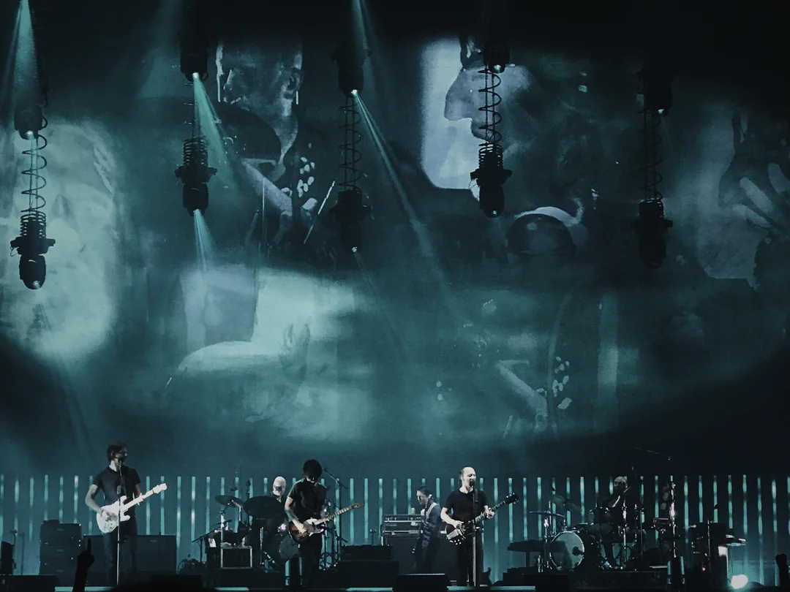

# Radiohead

**Radiohead** are an English rock band formed in Abingdon, Oxfordshire, in 1985. They comprise _Thom Yorke_ (vocals, guitar, piano, keyboards); brothers _Jonny Greenwood_ (guitar, keyboards, other instruments) and _Colin Greenwood_ (bass); _Ed O'Brien_ (guitar, backing vocals); and _Philip Selway_ (drums, percussion). They have worked with the producer _Nigel Godrich_ and the cover artist _Stanley Donwood_ since 1994. **Radiohead**'s experimental approach is credited with advancing the sound of alternative rock.

source: <a href="https://www.wikiwand.com/en/Radiohead" target="_blank">_Wikipedia_</a>

## Reviews of Albums
<a href="Ok_Computer/README.md">Ok Computer</a>

## Related links
<a href="../README.md">Return to Home</a>