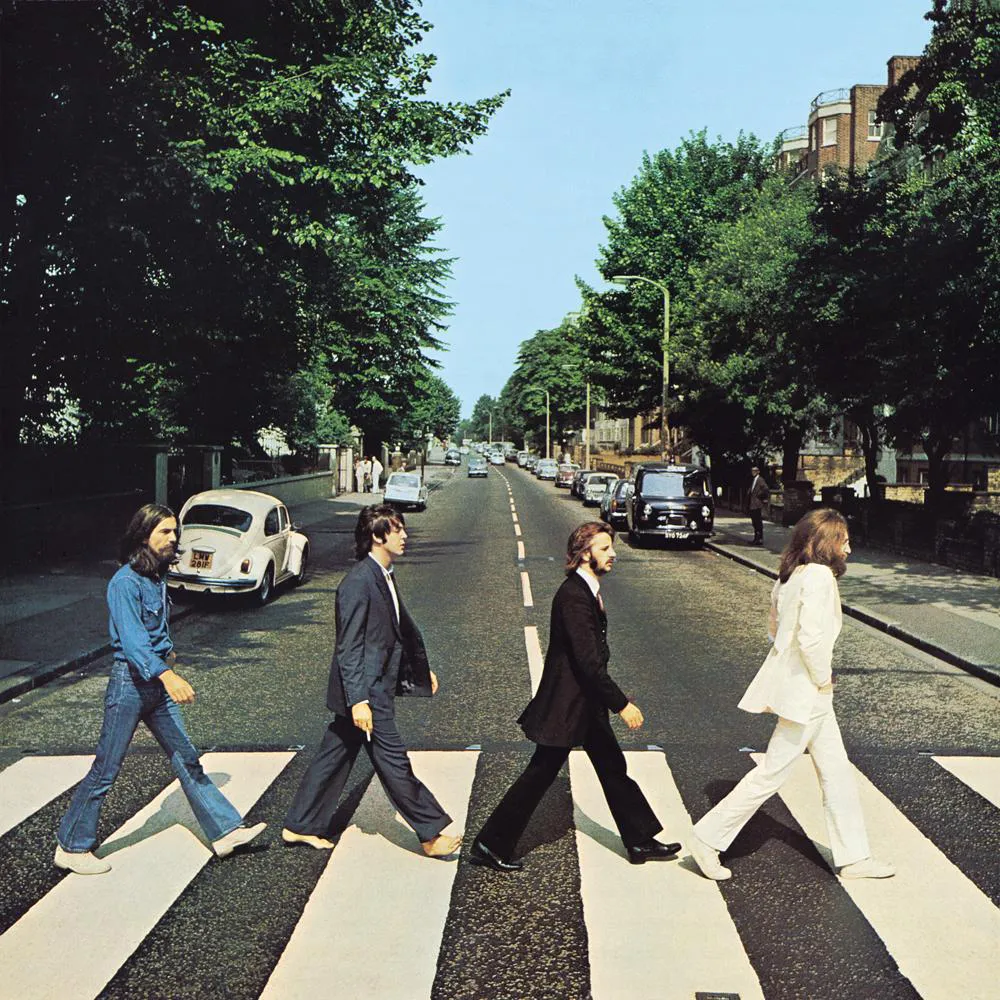

# Abbey Road
UK <a href="../README.md">EN</a>

## Rolling Stone
_The RS 500_ (Updated Dec 31, 2023)

«Це був дуже щасливий запис, - сказав продюсер **George Martin**, описуючи його в _«The Beatles Anthology»_. «Гадаю, він був щасливим, тому що всі думали, що він буде останнім». Дійсно, **Abbey Road** - записаний за два місяці влітку 1969 року - майже не був зроблений взагалі. Того січня **Beatles** були на межі розпаду, виснажені і злі один на одного після невдалих сесій для перерваної платівки **Get Back LP**, пізніше врятованої під назвою **Let It Be**. Проте, сповнені рішучості піти з тією ж славою, з якою вони вперше увійшли у світ на початку десятиліття, гурт знову зібрався на _EMI’s Abbey Road Studios_, щоб записати свій найбільш відшліфований альбом: збірку чудових пісень, зведених з увагою до дрібниць, а потім з'єднаних разом (особливо на другій стороні) з концептуальною силою.

Не було жодного тематичного зв'язку, окрім унікальних геніїв **Beatles**. **John Lennon** коливався від бурхливого металу **I Want You (She's So Heavy)** до вишуканого вокального світанку **Because**. **Paul McCartney** був зухвалим (**Oh! Darling**), дурнуватим (**Maxwell's Silver Hammer**) і смачно гірким (**You Never Give Me Your Money**). **George Harrison** довів свою довготривалу таємну цінність як композитор піснею **Something** (пізніше переспіваною **Frank Sinatra**) та діамантом фолк-попу **Here Comes the Sun**, написаною в саду його друга **Eric Clapton** після похмурого раунду ділових зустрічей. **Lennon**, **McCartney**, та **Harrison** заспівали тут більше тридольних гармоній, ніж у будь-якому іншому альбомі **Beatles**. Це тепле відчуття - відчуття того, як все більш роз'єднаний гурт тепло збирається разом, як друзі - може бути однією з причин, чому **Abbey Road** став найулюбленішим альбомом **Beatles** усіх часів.

source: <a href="https://www.rollingstone.com/music/music-lists/best-albums-of-all-time-1062063/the-beatles-abbey-road-2-1063228/" target="_blank">_Rolling Stone_</a>

## AllMusic
_Stephen Thomas Erlewine_

Загальноприйнято вважати, що «Бітлз» задумували **Abbey Road** як величне прощання, і ця підозра, здається, підтверджується елегійною нотою **Paul McCartney**, яку він вносить у фінальну частину альбому. Важко не інтерпретувати «_And in the end/the love you take/is equal to the love you make_» як підсумок не лише **Abbey Road**, а й, можливо, всієї кар'єри гурту, прекрасний фінальний настрій. Правда, можливо, трохи заплутаніша. **The Beatles** мали попередні плани щодо подальшого розвитку після виходу **Abbey Road** у вересні 1969 року, плани, які швидко розпалися на зорі нового десятиліття, і хоча існування цієї мети ставить під сумнів наміри альбому як фіналу, це анітрохи не змінює того, наскільки чудовим прощальним альбомом є цей запис. Багато в чому **Abbey Road** стоїть окремо від решти каталогу **Beatles**, альбом, який набуває значної сили завдяки своєму пишному, обволікаючому продакшену - запису настільки розкішному, що він затушовує естетичні розбіжності між трьома основними авторами пісень гурту і пов'язує воєдино серію роз'єднаних незавершених пісень в цілісну сюїту. Якщо **Sgt. Pepper** були першопрохідцями у застосуванні таких приголомшливих звукових технік, то **Abbey Road** по-справжньому скористалися можливостями студії і, таким чином, вказали шлях до ери альбомного року 1970-х років.

Багато студійних трюків з'являються під час цієї блискучої сюїти пісень, послідовності, яка триває майже цілу сторону альбому. Тут грайлива ексцентричність **McCartney** стикається з холодним цинізмом **John Lennon**, в той час як гурт захоплюється раптовими змінами настрою і грає багато гітарних партій, що досягає кульмінації, коли**McCartney**, **Lennon**,  і **George Harrison** обмінюються соло на пісні **The End**. Глибина звукових деталей у піснях **You Never Give Me Your Money** та **She Came in Through the Window** надала ідеї для цілих піджанрів поп-музики 70-х, але **Abbey Road** також містить кілька найтривкіших пісень **Beatles**, кожна з яких додає нової емоційної зрілості до їхнього каталогу. Приглушене бугі **Come Together** **Lennon** містить чуттєвість, раніше нечувану в **Beatles** - йому відповідає **Because**, яка, можливо, найкраще демонструє гармонію гурту - **Something** **Harrison** - любовна балада незвичайної чутливості, а його **Here Comes the Sun** - розпечена, можливо, його найчистіший вираз радості. Якими б гарними не були ці окремі моменти, що робить **Abbey Road** трансцендентним, так це те, що альбом є набагато більшим, ніж сума його частин. Хоча окрема пісня або сегмент можуть бути сліпучими, послідовність чудових, часом переплетених моментів - це не тільки диво, але й підсумок всього того, що зробило **Beatles** великими.

source: <a href="https://www.allmusic.com/album/abbey-road-mw0000192938" target="_blank">_AllMusic_</a>

## Related links
<a href="../../README.md#The_Beatles">Return to The_Beatles</a>