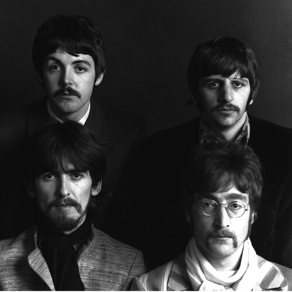

# The Beatles

**The Beatles** — британський біт-рок-гурт, створений 1960 року у Ліверпулі. Один з найуспішніших з комерційного погляду та найвпливовіших з музичного та культурного гуртів в історії попмузики. Кількість проданих платівок гурту перевищує один мільярд примірників, що є рекордом світової музичної індустрії. 15 альбомів гурту **The Beatles** очолювали хіт-паради Великої Британії — це більше, ніж у будь-якого іншого виконавця.

source: _[Wikipedia](https://www.wikiwand.com/uk/The_Beatles)_

## Reviews of Albums
<a href="Abbey_Road/README.md#Abbey_Road">Abbey Road</a>

## Related links
<a href="../README.md">Return to Home</a>