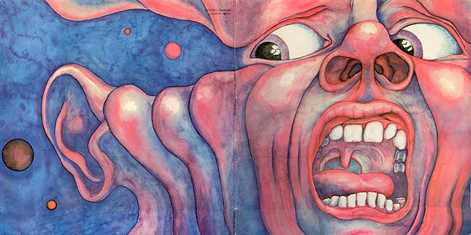

# Article 1

  

## Rolling Stone
***JOHN MORTHLAND*** (Jun 17, 1997)

There are certain problems to be encountered by any band that is consciously avant-garde. In attempting to sound "farout" the musicians inevitably impose on themselves restrictions as real as if they were trying to stay in a Top-40 groove. There's usually a tendency to regard weirdness as an end in itself, and excesses often ruin good ideas. Happily, King Crimson avoids these obstacles most of the time. Their debut album drags in places, but for the most part they have managed to effectively convey their own vision of Desolation Row. And the more I listen, the more things fall into place and the better it gets.

The album begins by setting the scene with "21st Century Schizoid Man." The song is grinding and chaotic, and the transition into the melodic flute which opens "I Talk to the Wind" is abrupt and breathtaking. Each song on this album is a new movement of the same work, and King Crimson's favorite trick is to move suddenly and forcefully from thought to thought. "Epitaph" speaks for itself: "The wall on which the prophets wrote/Is cracking at the seams ... Confusion will be my epitaph."

"Moonchild" opens the second side, and this is the only weak song on the album. Most of its twelve minutes is taken up with short statements by one or several instruments. More judicious editing would have heightened their impact; as it is, you're likely to lose interest. But the band grabs you right back when it booms into the majestic, symphonic theme of "The Court of the Crimson King." This song is the album's grand climax; it summarizes everything that has gone before it: "The yellow jester does not play/But gently pulls the strings/And smiles as the puppets dance / In the court of the Crimson King."

This set was an ambitious project, to say the least. King Crimson will probably be condemned by some for pompousness, but that criticism isn't really valid. They have combined aspects of many musical forms to create a surreal work of force and originality.

Besides which they're good musicians. Guitarist Robert Fripp and Ian McDonald (reeds, woodwinds, vibes, keyboards, mellotron) both handle rock, jazz, or classical with equal ease. Bassist Greg Lakes and drummer Michael Giles can provide the beat, fill in the holes, or play free-form. While Dylan and Lennon are still safe, lyricist Peter Sinfield does show a gift (macabre as it may be) for free association imagery.

How effectively this music can be on stage is, admittedly, a big question. The answer is probably not too well. Still, King Crimson's first album is successful; hopefully, there is more to come.

Source: ***[Rolling Stone](https://web.archive.org/web/20071022050233/http://www.rollingstone.com/artists/kingcrimson/albums/album/215038/review/6067524/in_the_court_of_the_crimson_king)***

